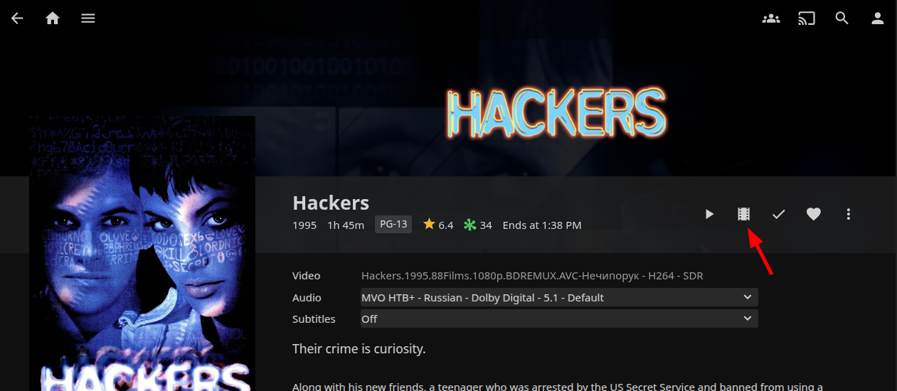
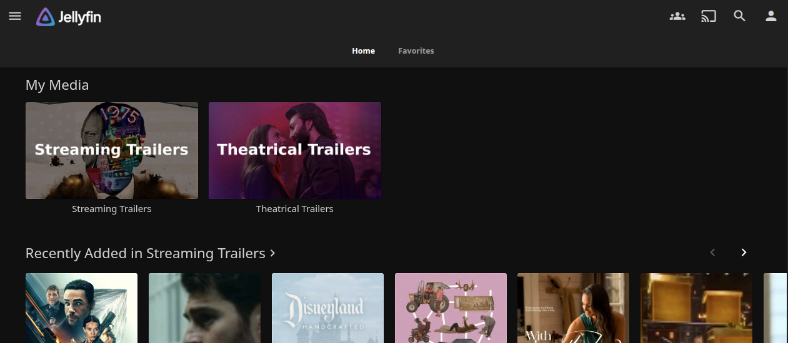
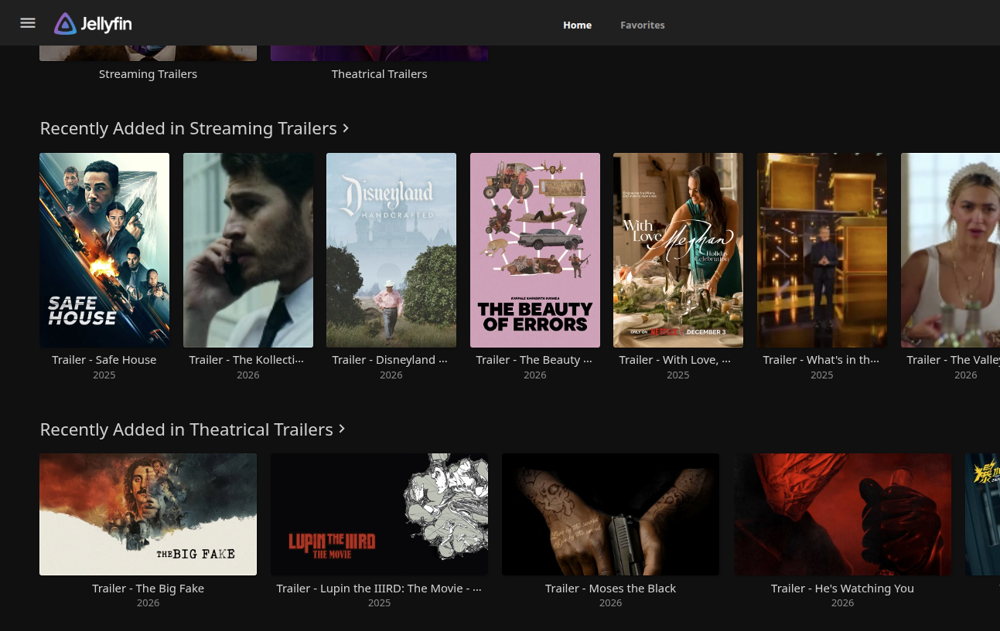
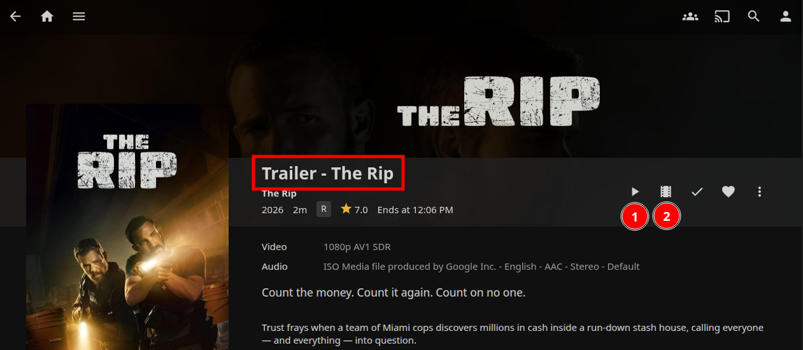

# Coming Attractions

**Get Streaming and Theatrical Trailers for Jellyfin/Emby/Plex**

This project gets upcoming TV and movie trailers from TMDb and YouTube, downloads them, and manages them for use with Jellyfin media servers. It supports both theatrical releases and streaming content from popular providers like Netflix, Prime Video, Disney+, and more.

[](https://github.com/robertsinfosec/coming-attractions/actions/workflows/ci-cd.yml)
[](https://github.com/robertsinfosec/coming-attractions/actions/workflows/ci-cd.yml)
[](https://codecov.io/gh/robertsinfosec/coming-attractions)
[](https://github.com/robertsinfosec/coming-attractions/security/code-scanning)
[](https://github.com/robertsinfosec/coming-attractions/pkgs/container/coming-attractions)
[](https://github.com/robertsinfosec/coming-attractions/pkgs/container/coming-attractions)
[](https://github.com/robertsinfosec/coming-attractions/blob/main/src/setup.py)
[](https://github.com/robertsinfosec/coming-attractions/blob/main/LICENSE)
[](https://github.com/robertsinfosec/coming-attractions/commits/main)
[](https://github.com/robertsinfosec/coming-attractions/issues)
[](https://github.com/robertsinfosec/coming-attractions/pulls)
[](https://github.com/robertsinfosec/coming-attractions/security/dependabot)


> [!NOTE]
> This is different from "[Trailerfin](https://github.com/Pukabyte/trailerfin)". Trailerfin associates the streaming trailer for the movie or TV series that is already in your library. If the stream file is there, then you see Trailer icon for *existing* movies in your library (in Jellyfin, for example):
>
> > 
>  
> With this Coming Attractions fetches upcoming trailers for movies and TV shows that you may want to add to your library in the future. These are downloaded videos, stored in a different Library, and "Trailer - " is prefixed to the title so that you can tell them apart from the actual movie or TV series.

## Example in Jellyfin

This is configured to download theatrical trailers and also streaming trailers (from Netflix, Prime Video, Disney+, HBO Max, Hulu, Apple TV+, Paramount+, Peacock, Showtime, and Starz) for the next 180 days and the past 90 days. Trailers are stored in separate libraries in Jellyfin. From there, I set up libraries for "Streaming Trailers" and "Theatrical Trailers". These would be additional libraries alongside your existing "Movies" and "TV Series" libraries.

> 

In Jellyfin, these are two additional "Libraries", which also support the "Recently added in..." view for both:

> 

Now, this isn't perfect, for a few reasons. First, for upcoming movies and TV shows, sometimes the metadata is incomplete or missing. Also, the example here is Jellyfin, and it has no concept of "coming attractions". So, as you can see below, the trailer will look like a regular movie or TV show.

Confusingly, button "1" below plays the actual movie trailer that this project downloaded. The title though, has been prefixed with "Trailer - " to help distinguish it from the actual movie or TV show. Button "2" is from Trailerfin, because it found the *streaming* trailer for this particular title on YouTube. So, button "2" plays a potentially different trailer than the one that was downloaded.

> 

With that said, this is still a very useful and automated way to see what is coming soon to threaters, and also what is coming soon to the streaming services that this supports, which are (as of Jan 2026):

- Amazon Prime
- Apple TV+
- Disney+
- HBO Max
- Hulu
- Netflix
- Paramount+
- Peacock
- Showtime
- Starz

### About "Automation"

The idea behind this being "automated" is that you just need to set this up once, and then it will keep your trailer libraries up to date in the background - forever.

- **Always Getting New Ones:** this will automatically keep pulling in new trailers as they are announced and available on TMDb. Mine is configured to run every 12 hours. So, some days there are no trailers, other days there are several new ones - but you get the latest ones pretty quickly after being announced.

- **Always Pruning Old Ones:** old trailers are automatically pruned based on your retention settings (default: 2 years). This is settable. This makes sure that your trailer libraries don't grow out of control over time, and it also keeps your "Coming Attractions" relevant. Again, if you now have that movie or TV series, then Trailerfin is the better tool to directly associate the trailer with your existing library item.

This means at any given time, you will have movie and streaming service trailers for upcoming titles, and you'll have older ones up to two years old before they fall off.

## Features

### Dual Mode Operation

- **Theatrical Mode**: Upcoming, now playing, and popular movies from TMDb feeds
- **Streaming Mode**: Discover movies and TV shows from specific streaming providers
- **Both Mode**: Run theatrical and streaming fetches together

### Smart Trailer Selection

- Prioritizes official trailers over teasers
- One trailer per title (highest quality)
- Configurable video quality (up to 4K)
- Automatic video+audio merge via ffmpeg

### Intelligent Management

- Configurable retention policies (default: 2 years)
- Automatic cleanup of old trailers
- Tracks removed trailers to prevent re-downloading
- Atomic file operations for reliability

### Jellyfin Integration

- Automatic "Trailer - " prefix for proper display
- NFO metadata generation
- TV show detection with [TV] suffix
- Compatible with existing Jellyfin libraries

### Production Ready

- Daemon mode with configurable intervals
- Comprehensive logging (console + file)
- Dry-run mode for testing
- Environment variable support

### Multi-Platform Support

Runs on a wide range of hardware architectures without additional configuration.

- Works seamlessly on AMD/Intel and ARM processors
- Native support for Raspberry Pi (all models)
- Compatible with macOS via Docker Desktop (Intel & Apple Silicon)
- Automatic architecture detection - no configuration needed

## Quick Start

Here are two quick ways to get started with Coming Attractions: using Docker Compose (recommended) or installing and running the CLI directly.

### Docker Compose (Recommended)

If you run Jellyfin, Emby, or Plex as a Docker Compose service, this is the easiest way to get started. Just add the following service to your existing `docker-compose.yml`, or create a new one. It doesn't need any ports exposed, you just need to point to the root of the folder where you want trailers stored.

```yaml
version: '3.8'

services:
  coming-attractions:
    image: ghcr.io/robertsinfosec/coming-attractions:latest
    container_name: coming-attractions
    restart: unless-stopped
    environment:
      - TZ=America/New_York
      - TMDB_API_KEY=${TMDB_API_KEY}  # Required
      - TMDB_REGION=US
      - RETENTION_YEARS=2
      - DAYS_AHEAD=180
      - DAYS_BACK=90
      - MAX_HEIGHT=1080
      - METADATA_WAIT_SECONDS=300  # Wait 5 min for Jellyfin metadata (default)
      - LOG_TIMESTAMPS=1
    volumes:
      - /path/to/trailers:/data/trailers
      - ./config:/config
    command: daemon --interval 12h
```

### Standalone CLI

If you want to install and run the CLI directly on your system, follow these steps:

```bash
# Install from src directory
pip install -e src/

# Fetch trailers
coming-attractions fetch \
  --api-key $TMDB_API_KEY \
  --mode theatrical \
  --out-dir /data/trailers/theatrical \
  --days-ahead 180

# Prune old trailers
coming-attractions prune \
  --retention-years 2 \
  --theatrical-dir /data/trailers/theatrical \
  --streaming-dir /data/trailers/streaming

# Fix titles
coming-attractions fix-titles \
  --root-dir /data/trailers/theatrical

# Run daemon
coming-attractions daemon --interval 12h
```

## Commands

The CLI provides four main commands for managing your trailer collection.

### `fetch` - Download Trailers

Fetch trailers from TMDb and YouTube.

```bash
coming-attractions fetch [OPTIONS]

Options:
  --api-key TEXT              TMDb API key (required) [env: TMDB_API_KEY]
  --mode [theatrical|streaming|both]  Fetch mode [env: MODE]
  --region TEXT               Region code (ISO 3166-1) [env: TMDB_REGION]
  --out-dir PATH              Output directory [env: OUT_DIR]
  --days-ahead INTEGER        Days ahead for upcoming [env: DAYS_AHEAD]
  --days-back INTEGER         Days back for now playing [env: DAYS_BACK]
  --max-pages INTEGER         Max pages per feed [env: MAX_PAGES]
  --max-height INTEGER        Max video height [env: MAX_HEIGHT]
  --dry-run                   Show what would happen [env: DRY_RUN]
  --debug                     Enable debug logging [env: DEBUG]
  --timestamps                Add timestamps to output [env: LOG_TIMESTAMPS]
  --log-file TEXT             Log to file [env: LOG_FILE]
```

#### Examples

```bash
# Fetch theatrical trailers for US region
coming-attractions fetch \
  --api-key abc123 \
  --mode theatrical \
  --region US \
  --out-dir /data/trailers/theatrical

# Fetch streaming content (movies + TV)
MODE=streaming \
MEDIA_TYPES=movie,tv \
WATCH_PROVIDERS=8,9,337 \
coming-attractions fetch --api-key abc123

# Dry-run to preview
coming-attractions fetch --api-key abc123 --dry-run
```

### `prune` - Remove Old Trailers

Remove trailers older than retention period.

```bash
coming-attractions prune [OPTIONS]

Options:
  --retention-years INTEGER   Years to retain [env: RETENTION_YEARS]
  --theatrical-dir PATH       Theatrical directory [env: THEATRICAL_DIR]
  --streaming-dir PATH        Streaming directory [env: STREAMING_DIR]
  --removed-file PATH         Removed trailers file [env: REMOVED_FILE]
  --dry-run                   Show what would be removed [env: DRY_RUN]
  --force                     Non-interactive mode
  --debug                     Enable debug logging [env: DEBUG]
  --timestamps                Add timestamps [env: LOG_TIMESTAMPS]
  --log-file TEXT             Log to file [env: LOG_FILE]
```

#### Examples

```bash
# Preview what would be removed (dry-run)
coming-attractions prune --retention-years 2 --dry-run

# Remove trailers older than 3 years
coming-attractions prune --retention-years 3

# Non-interactive (for cron)
coming-attractions prune --retention-years 2 --force
```

### `fix-titles` - Add Trailer Prefix

Add "Trailer - " prefix to titles in NFO files. This is because if you have a movie in your library called "Super Great Movie" that came out a few months ago, this tool will likely pick up the trailer for it as well. Then, when you search for "Super Great Movie" in Jellyfin for example, it will show you *BOTH* the actual movie and the trailer, and you won't be able to tell them apart.

To fix this, this command goes through all NFO files in the specified directory and adds "Trailer - " to the start of the `<title>` field. So now, when you search for "Super Great Movie", you'll see the actual movie, and then the trailer will be listed as "Trailer - Super Great Movie", making it easy to distinguish between the two.

```bash
coming-attractions fix-titles [OPTIONS]

Options:
  --root-dir PATH             Root directory to scan [env: ROOT_DIR]
  --prefix TEXT               Prefix to add (default: "Trailer - ")
  --debug                     Enable debug logging [env: DEBUG]
  --timestamps                Add timestamps [env: LOG_TIMESTAMPS]
  --log-file TEXT             Log to file [env: LOG_FILE]
```

#### Examples

```bash
# Fix theatrical titles
coming-attractions fix-titles --root-dir /data/trailers/theatrical

# Custom prefix
coming-attractions fix-titles --prefix "Coming Soon - "
```

### `daemon` - Continuous Operation

Run complete workflow on interval.

```bash
coming-attractions daemon [OPTIONS]

Options:
  --interval TEXT             Interval (e.g., 12h, 6h, 1d)
  --metadata-wait INTEGER     Wait for Jellyfin metadata [env: METADATA_WAIT_SECONDS]
  --retention-years INTEGER   Retention for pruning [env: RETENTION_YEARS]
  --api-key TEXT              TMDb API key [env: TMDB_API_KEY]
  --debug                     Enable debug logging [env: DEBUG]
  --timestamps                Add timestamps [env: LOG_TIMESTAMPS]
  --log-file TEXT             Log to file [env: LOG_FILE]
```

#### Workflow

The daemon executes the following steps in order:

1. Prune old trailers (retention policy)
2. Fetch theatrical trailers
3. **Wait for Jellyfin metadata** (default: 5 min) - Allows Jellyfin to detect new files and generate NFO metadata
4. Fix theatrical titles (adds "Trailer - " prefix to NFO files)
5. Fetch streaming trailers
6. **Wait for Jellyfin metadata** (default: 5 min)
7. Fix streaming titles
8. Sleep for configured interval
9. Repeat

#### Examples

```bash
# Run every 12 hours
coming-attractions daemon --interval 12h

# Run every 6 hours with custom metadata wait
coming-attractions daemon --interval 6h --metadata-wait 600

# Run daily
coming-attractions daemon --interval 1d
```

## Environment Variables

All CLI options can be set via environment variables:

| Variable                | Description                             | Default                            |
| ----------------------- | --------------------------------------- | ---------------------------------- |
| `TMDB_API_KEY`          | **Required.** TMDb API key              | -                                  |
| `MODE`                  | Fetch mode: theatrical, streaming, both | `both`                             |
| `TMDB_REGION`           | Region code (ISO 3166-1 alpha-2)        | `US`                               |
| `OUT_DIR`               | Output directory                        | `/data/trailers`                   |
| `DAYS_AHEAD`            | Days ahead for upcoming window          | `180`                              |
| `DAYS_BACK`             | Days back for now playing               | `90`                               |
| `MAX_PAGES`             | Max pages per feed                      | `5`                                |
| `MAX_HEIGHT`            | Max video height (480-4320)             | `1080`                             |
| `RETENTION_YEARS`       | Years to retain trailers                | `2`                                |
| `THEATRICAL_DIR`        | Theatrical trailers directory           | `./theatrical`                     |
| `STREAMING_DIR`         | Streaming trailers directory            | `./streaming`                      |
| `REMOVED_FILE`          | Removed trailers tracking file          | `./.trailer-removed.txt`           |
| `MEDIA_TYPES`           | Streaming media types (movie,tv)        | `movie,tv`                         |
| `WATCH_PROVIDERS`       | Streaming provider IDs (see below)      | `8,9,337,384,15,350,531,386,37,43` |
| `WATCH_REGION`          | Streaming region                        | `US`                               |
| `DRY_RUN`               | Enable dry-run mode                     | `0`                                |
| `DEBUG`                 | Enable debug logging                    | `0`                                |
| `LOG_TIMESTAMPS`        | Add timestamps to logs                  | `0`                                |
| `LOG_FILE`              | Log file path                           | -                                  |
| `METADATA_WAIT_SECONDS` | Jellyfin metadata wait (daemon)         | `300`                              |

## Configuration

Configure Coming Attractions using environment variables, CLI arguments, or a combination of both.

### TMDb API Key

Get your free API key from [TMDb](https://www.themoviedb.org/settings/api):

1. Create a TMDb account
2. Go to Settings → API
3. Request an API key (choose "Developer")
4. Copy the API Key (v3 auth)

### Streaming Providers

Default providers (major US platforms):

| Provider    | TMDb ID |
| ----------- | ------- |
| Netflix     | 8       |
| Prime Video | 9       |
| Disney+     | 337     |
| HBO Max     | 384     |
| Hulu        | 15      |
| Apple TV+   | 350     |
| Paramount+  | 531     |
| Peacock     | 386     |
| Showtime    | 37      |
| Starz       | 43      |

Find provider IDs: `https://api.themoviedb.org/3/watch/providers/movie?api_key=YOUR_KEY`

### Jellyfin Integration

Follow these steps to create separate trailer libraries in Jellyfin.

#### 1. Create trailer libraries

You just need the parent directory where trailers are stored. For example, and the movie folders will be created automatically underneath.

   ```
   /data/trailers/
   ├── theatrical/
   │   └── Movie Title (2026)/
   │       ├── Movie Title (2026).mp4
   │       └── movie.nfo
   └── streaming/
       └── Movie Title (2026)/
           ├── Movie Title (2026).mp4
           └── movie.nfo
   ```

#### 2. Add libraries in Jellyfin

Next, add the new libraries in Jellyfin:

   - Type: "Movies"
   - Path: `/data/trailers/theatrical`
   - Content type: "Movies"
   - Enable "Trailers" metadata provider
   - Repeat for `/data/trailers/streaming`

## Output Format

Understand the console output and log formatting used by Coming Attractions.

### Console Output

```
[*] Fetching upcoming movies...
[*]   Found 150 items
[*] Downloading: Dune Part Three (2026)
[*]   YouTube URL: https://youtube.com/watch?v=...
[+]   Downloaded: Dune Part Three (2026)
[*] Skipping: exists. Another Movie (2025)

[*] ────────────────────────────────────────────────────────────────
[*] Trailer Fetcher Summary
[*] ────────────────────────────────────────────────────────────────
[*] Mode: theatrical
[*] Region: US
[*] Window: 90 days back, 180 days ahead
[*] 
[+] Present/Downloaded: 150
[*] Skipped: 130
[*] 
[*] Skip reasons:
[*]   Out Of Window: 63
[*]   No Video Available: 45
[*]   Download Failed: 2
[+] Trailer fetching complete.
```

### Log Prefixes

Log prefixes used in console and log file output:

- `[*]` - Informational (cyan)
- `[+]` - Success (green)
- `[-]` - Error (red)
- `[!]` - Warning (yellow)

## Troubleshooting

Common issues and their solutions.

### Common Issues

#### "TMDB_API_KEY is required"

Note that a TMDb API key is required to use this tool. You get a free key from [TMDb](https://www.themoviedb.org/settings/api), and instructions are [here](https://developer.themoviedb.org/docs/getting-started). Then, you provide that API key either as an environment variable or via the command line.

- Set environment variable: `export TMDB_API_KEY=your_key`
- Or pass via CLI: `--api-key your_key`

#### "Directory is not writable"

- Check permissions on output directory
- Docker: Ensure volume mount has correct permissions
- Try: `chmod 777 /data/trailers`

#### "Download failed"

- Check internet connectivity
- Verify yt-dlp is installed: `yt-dlp --version`
- Check YouTube URL is accessible
- Enable debug mode: `--debug`

#### "No trailers found"

- Check date window settings (--days-ahead, --days-back)
- Verify region code (--region US)
- Enable debug to see API responses: `--debug`
- Check TMDb API status

#### "Jellyfin not showing trailers"

- Run `fix-titles` command to add "Trailer - " prefix
- Check NFO files contain correct metadata
- Refresh library metadata in Jellyfin
- Ensure "Trailers" provider is enabled

### Debug Mode

Enable verbose logging:

```bash
coming-attractions fetch --api-key abc123 --debug
```

Log to file:

```bash
coming-attractions fetch --api-key abc123 --log-file /tmp/trailers.log
```

Add timestamps:

```bash
coming-attractions fetch --api-key abc123 --timestamps
```

### Dry-Run Mode

Preview changes without modifying anything:

```bash
# Preview fetch
coming-attractions fetch --api-key abc123 --dry-run

# Preview prune
coming-attractions prune --retention-years 2 --dry-run
```


## Documentation

### For Users

- **[User Guide](docs/USER_GUIDE.md)** - Complete command reference and usage examples
- **[Docker Guide](docs/DOCKER.md)** - Docker and Docker Compose deployment
- **[Jellyfin Integration](docs/JELLYFIN_INTEGRATION.md)** - Setting up trailer libraries in Jellyfin

### For Contributors

- **[Contributing Guide](CONTRIBUTING.md)** - How to contribute to this project
- **[Developer Setup](docs/dev/SETUP.md)** - Development environment setup
- **[Testing Guide](docs/dev/TESTING.md)** - Writing and running tests
- **[Architecture Guide](docs/dev/ARCHITECTURE.md)** - Project structure and design
- **[Style Guide](STYLE_GUIDE.md)** - Code quality standards

### Reference

- **[Changelog](CHANGELOG.md)** - Version history and release notes
- **[Product Requirements](docs/PRD.md)** - Original product requirements document

## License

MIT License - see [LICENSE](LICENSE) file for details.

## Acknowledgments

- [TMDb](https://www.themoviedb.org/) for movie metadata API
- [yt-dlp](https://github.com/yt-dlp/yt-dlp) for YouTube downloads
- [Jellyfin](https://jellyfin.org/) for media server platform

## Support

- 🐛 [Report bugs](https://github.com/robertsinfosec/coming-attractions/issues)
- 🔒 [Report Security Vulnerabilities](https://github.com/robertsinfosec/coming-attractions/security)
- 💡 [Request features](https://github.com/robertsinfosec/coming-attractions/issues)
- 📖 [Documentation](https://github.com/robertsinfosec/coming-attractions)
- 💬 [Discussions](https://github.com/robertsinfosec/coming-attractions/discussions)


